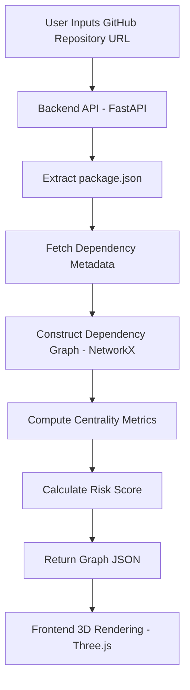

# OpenPulse 🌍

**OpenPulse** is an open-source 3D dependency health visualizer that exposes structural fragility in software projects.

Modern applications rely on deep and complex dependency chains. While vulnerability scanners detect known issues, they do not reveal structural ecosystem risk such as centrality, maintainer concentration, or inactivity patterns.

OpenPulse makes dependency risk visible.

---

## Table of Contents

* [Problem](#problem)
* [Solution Overview](#solution-overview)
* [Core Features](#core-features)
* [System Architecture](#system-architecture)
* [Risk Model](#risk-model)
* [Why 3D Visualization?](#why-3d-visualization)
* [Tech Stack](#tech-stack)
* [Use Case Example](#use-case-example)
* [Roadmap](#roadmap)
* [License](#license)

---

## Problem

Open-source software powers critical infrastructure across the world. However:

* Projects depend on deeply nested transitive packages.
* Critical libraries may have very few maintainers.
* Some central dependencies are inactive.
* Structural fragility is invisible until failure occurs.
* 2D dependency trees become unreadable at scale.

Developers lack intuitive insight into:

* Which dependency is most critical.
* What breaks if a package disappears.
* Where ecosystem risk is concentrated.
* How dependency depth affects stability.

OpenPulse addresses this visibility gap.

---

## Solution Overview

OpenPulse provides:

1. Automated dependency extraction from a GitHub repository.
2. Graph-based structural analysis.
3. Composite dependency risk scoring.
4. Interactive 3D visualization.
5. Structural collapse simulation.

The system focuses on structural ecosystem health, not vulnerability scanning.

---

## Core Features

* GitHub repository input
* npm dependency parsing (initial scope)
* Depth-limited dependency graph (2 levels)
* Centrality computation
* Maintainer and activity metadata analysis
* Composite structural risk score
* Interactive 3D dependency network
* Node inspection panel
* Dependency removal simulation

---

## System Architecture

### High-Level Flow



---

### Component Breakdown

**Input Layer**

* Accepts public GitHub repository URL.
* Extracts dependency file.

**Data Enrichment**

* npm registry API for dependency metadata.
* GitHub API for:

  * Last commit date
  * Contributor count
  * Issue statistics

**Graph Engine**

* Directed dependency graph.
* Centrality metrics:

  * Degree centrality
  * Betweenness centrality
* Dependency depth mapping.

**Risk Engine**

* Composite structural risk scoring model.

**Visualization Layer**

* Force-directed 3D layout.
* Node size proportional to centrality.
* Node color mapped to risk.
* Interactive camera and node inspection.

---

## Risk Model

Risk Score (0–100) is computed using:

```
Risk =
    (0.4 × Centrality Score) +
    (0.3 × Inactivity Score) +
    (0.2 × Maintainer Scarcity Score) +
    (0.1 × Dependency Depth Factor)
```

This model identifies structurally fragile dependencies within a project.

OpenPulse does not replace security audit tools. It highlights architectural fragility.

---

## Why 3D Visualization?

Large dependency graphs suffer from edge overlap and cluster congestion in 2D.

3D enables:

* Spatial cluster separation
* Improved structural clarity
* Interactive dependency exploration
* Better perception of centrality

The visualization enhances comprehension rather than acting as decoration.

---

## Tech Stack

**Frontend**

* React
* Three.js
* WebGL

**Backend**

* FastAPI
* NetworkX
* npm Registry API
* GitHub REST API

**Deployment**

* Frontend: Vercel
* Backend: Render (free tier)

**License**

* MIT

---

## Use Case Example

1. Developer submits a repository URL.
2. OpenPulse generates a dependency network.
3. A central node appears in red.
4. Inspection reveals:

   * Single maintainer
   * Low recent activity
   * High structural centrality
5. Developer understands ecosystem fragility before failure occurs.

---

## Roadmap

**Phase 1 (Hackathon Scope)**

* npm support only
* Depth-limited graph
* Structural risk scoring
* Interactive 3D rendering

**Future Expansion**

* Python ecosystem support
* GitHub App integration
* CI/CD pipeline analysis
* Historical dependency evolution tracking

---

## License

This project is licensed under the Apache-2.0 License.

---

## Footer

OpenPulse
Structural Visibility for Open-Source Ecosystems

Built for open collaboration and ecosystem transparency.

## Phase 14 - Performance Optimization

Phase 14 focuses on large-graph rendering stability and frame consistency.

### Optimizations Delivered

- Instanced mesh node rendering retained and tuned for lower geometry complexity.
- Edge rendering consolidated into a single `lineSegments` draw call to reduce object count.
- Force simulation updates are now batched in Zustand to prevent per-node state churn.
- Scene bootstrap now targets a 200-node fallback dataset to validate performance goals.
- Simulation tick cadence is throttled for smoother frame pacing under heavier graphs.

### Phase 14 Validation

1. Start backend:
   - `cd backend && uvicorn main:app --reload --port 8000`
2. Start frontend:
   - `cd frontend && npm install && npm run dev`
3. Open `http://localhost:3000`.
4. If backend is unavailable, the app auto-loads a 200-node demo graph.
5. Interact with orbit controls and inspect hover/click node behavior.

Expected result: smooth navigation and interaction on a graph at or above 200 nodes without frame stutter on a modern laptop GPU.
